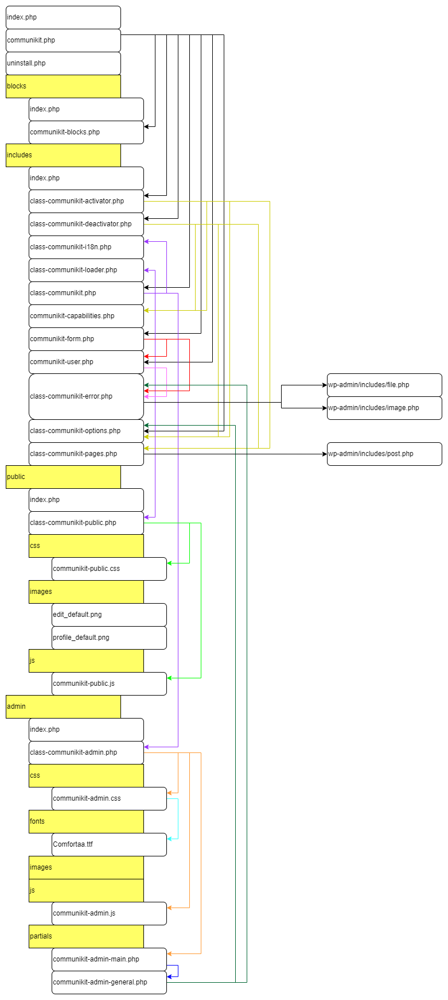

## Current state of this project
I am currently waiting for the company behind WordPress, especially the CEO, to stop doing bullshit. When he decides to stop being an asshole, this project will go on.

# CommuniKit
Hi there,

I started this project because the already existing WordPress plugins for handling community websites didn't offer what I needed. I required Gutenberg blocks that I could customize to match my website's style.

At first, I only began building my own blocks, which was, in fact, one of the hardest parts of this project. I analyzed existing WordPress blocks to understand their mechanisms.

The plugin as it exists today is the result of all the ideas I've had while creating it.
After each step, I think about the next. There's no roadmap yet.

## Things I want to add in the future
+ I want every Gutenberg block in this plugin to be as customizable as possible (I am currently working on this)

## Structure

